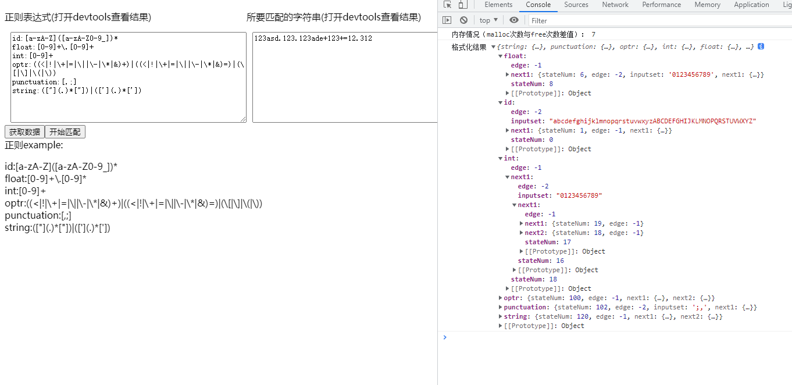
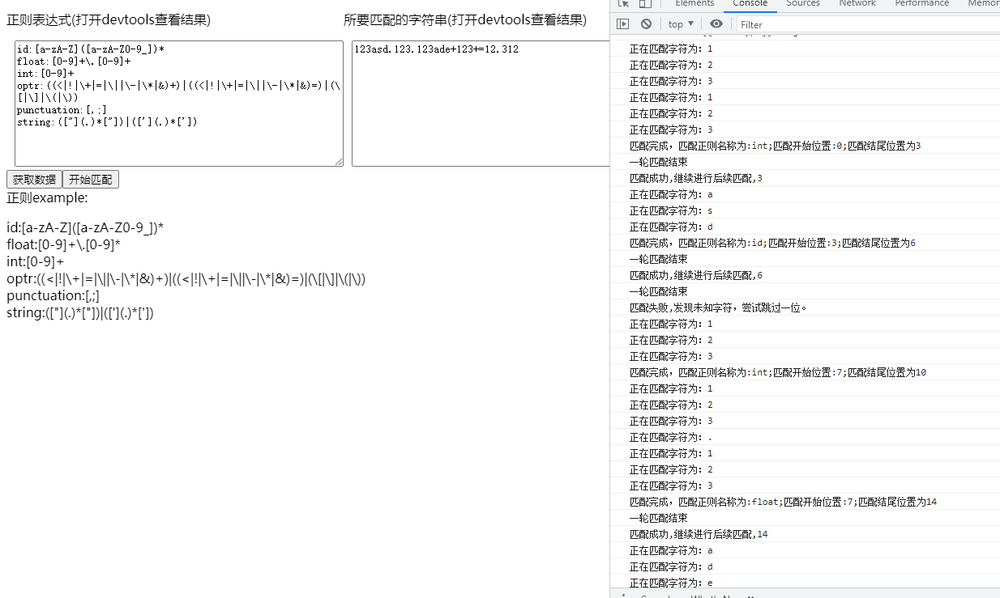

# compilingTheory

目前使用方式：

-   使用 **vscode** 编辑器，其他编辑器需自行修改配置。
-   yarn 安装依赖包
-   配置 emscripten 环境
-   安装 cmake
-   创建 wasm_folder 文件夹
-   快速运行
    1. 方案一: 安装**Code Runner**拓展，进入 main.c，右键然后选择 **Run Code** 按钮(根据自己的需求修改 **.vscode** 下的 settings.json 选项)
    2. 方案二: 自行使用 emscripten 加 cmake 打包,将生成的**lexical.js**,以及**lexical.wasm**文件放入 **wasm_folder** 文件夹中。
-   运行 **yarn serve**
-   建议安装 **CMake Tools** 拓展
## 依赖包

-   [CJSON](https://github.com/DaveGamble/cJSON)

## 目前效果图(时间：2021年11月16日 22:24:21)
- 图1

- 图2

